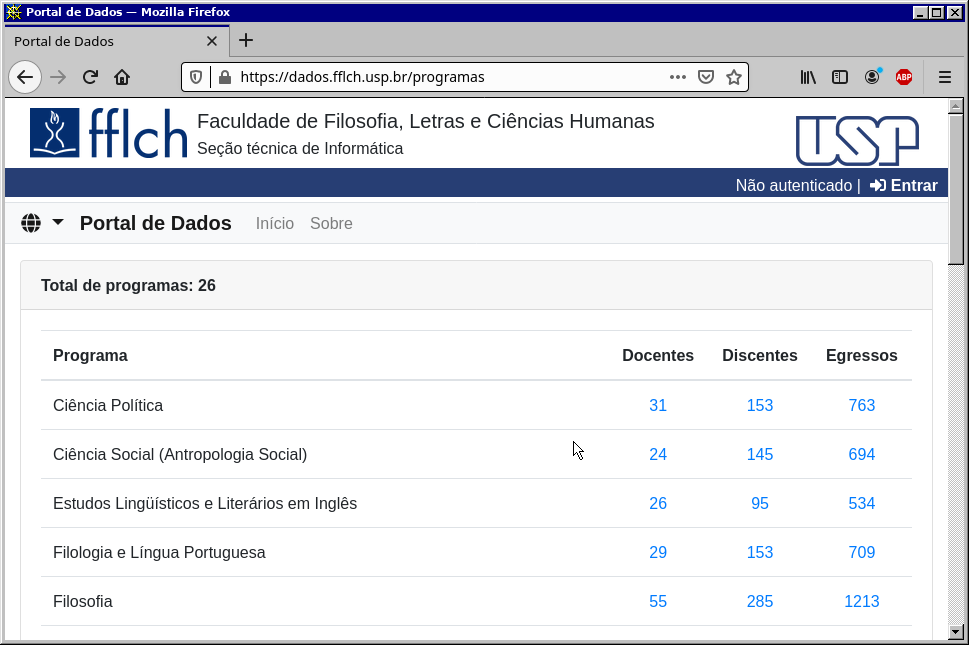
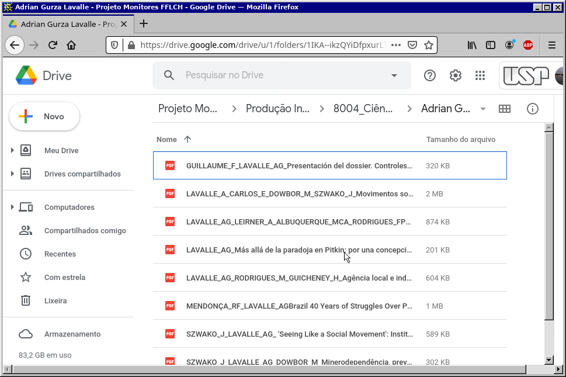

# webscraper-biblioteca

---

This README file is also available in [Português](README.md)  

#### What is this project?

I came up with this code as an attempt to automatize some tasks I was assigned to, related to the support work I've been doing for the Florestan Fernandes Library in the Faculdade de Filosofia, Letras e Ciências Humanas of the USP (Faculty of Philosophy, Languages and Human Sciences of the University of São Paulo). The work as a whole, apparently, involves gathering information and creating a database on the intellectual production of teachers from all the different post-graduation programs offered by the institution.

The idea was to seize the occasion and learn a little more about automation and data scraping in python and the project is nothing more than a practical exercise for the *requests* and *BeautifulSoup* libraries as well as the *os* and *re* modules.

#### Requirements:

- Anaconda (Python 3.8)

- BeautifulSoup 4.9.3

- python-docx 0.8.10

#### What is it supposed to do?

From a spreadsheet containing a list of all post-graduation programs offered, a Google Drive repository was created containing a folder for each of these programs. A program has been assigned to each monitor (including me) and the task consists of:

- Access a list of teachers from the given program in the FFLCH Web Portal:

- Access each teacher's page to obtain a list of published articles:

- Create a .txt or a .docx file in the program folder. This file will list the teachers' names and their respective articles. It will need to include the publication's DOI or at least an active link for the article on-line:

- Create a folder for each teacher within the program's root directory and, whenever is possible, download the PDF file to this folder:

- Rename the file to match following format: Surname_Initials_Article's title capitalized (example, Marques_ACDR_Matéria profusa apresentação do dossiê O que carrega o sangue).

#### What does it do?

Considering that I don't have any big plans for this project (besides doing my job for me), I've been writing it on a .ipynb file through Jupyter Notebook. One day, perhaps, I'll organize it and put it on proper .py files.

At this point, I've wrote three blocks of code working separately for different purposes. The program as a whole makes no much sense at all.

The first block will use *requests* to get the source code from the Web Portal. With the source code properly parsed it will use *BeautifulSoup* to gather the teachers' names and a link to each teacher's page where it will find and gather the titles of the publications they've written.

The second block contains some experiments I've been doing with *python-docx* to create the .docx file in which the data will be written.

The third block basically creates folders from a names list.

#### Issues:

There are two main issues I've been trying to solve for this project to work.

**1)** The titles problem: the algorithm returns a list with the titles, but instead of a nice list with normal strings it gives me a lot of information cut with escape sequences like:

		["\n                                                \n                        Exploração de redes associativas no ensino do léxico\n                        LINHA D'AGUA,\n                        v. 32,\n                        p. 45 - 61,\n                        2019. ISSN: 01033638.\n                    ",
		'\n                                                \n                        Impropriedades lexicais em textos de estudantes universitários\n                        REVISTA DO GELNE,\n                        v. 20,\n                        p. 72 - 82,\n                        2018. ISSN: 15177874.\n                    ',
		'\n                                                \n                        A PLURIDIMENSIONALIDADE DO LÉXICO EM PRÁTICAS DE ENSINO DE PORTUGUÊS\n                        Entremeios,\n                        v. 15,\n                        p. 13 - 30,\n                        2017. ISSN: 21793514.\n                    '] 

I need to get rid of them. In fact I'll need as well to filter those strings from all that is not the article's title, put everything in lower case and capitalize it. The expected output would be:

		["Exploração de redes associativas no ensino do léxico\n", "Impropriedades lexicais em textos de estudantes universitários\n", "A pluridimensionalidade do léxico em práticas de ensino de português\n"] 

I've been messing with *regex* to sort this out but I'm still not getting it.

**2)** The .docx file: To get the names and the titles associated to them I've wrote a *for* where the names are sorted and for each name it calls a function to get those titles associated to them. This function returns a list with the titles on it and this list is added to the teacher's list right after the name. So the teachers' list contains the name of one teacher, a list with article titles, another name and so on. The problem, as one can see, is that I can't make python write this teachers list on a .txt or a .docx because It can't go inside those articles lists to get the strings. At least not with a single *for*. I'm not working on that issue yet so haven't actually tried anything.

Any idea or suggestion is more than welcome.

Éde
