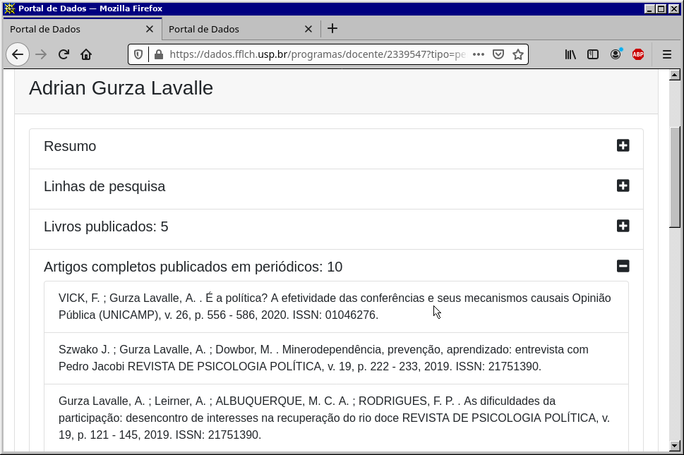
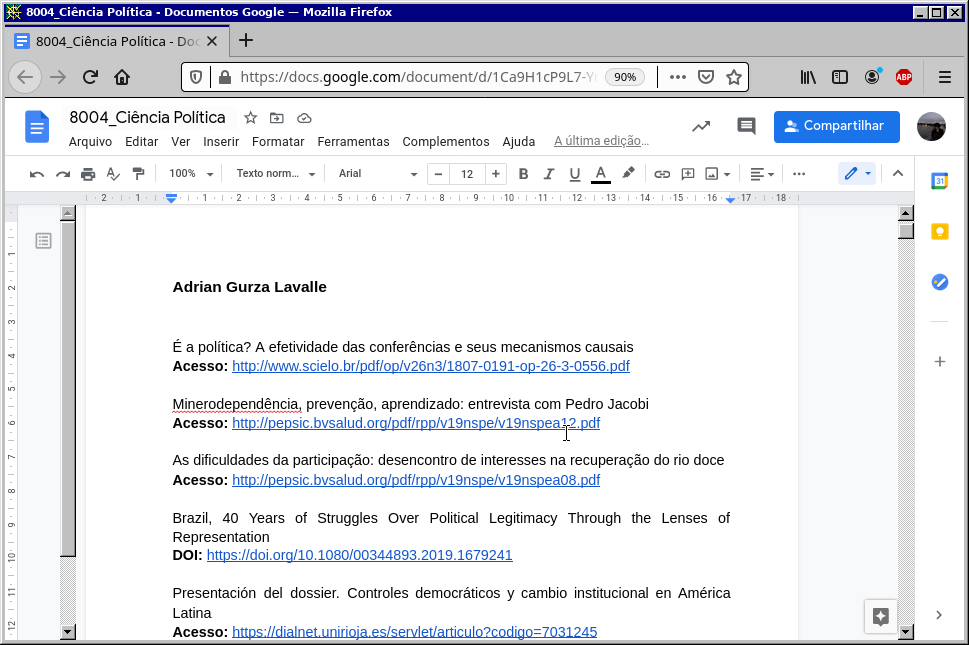
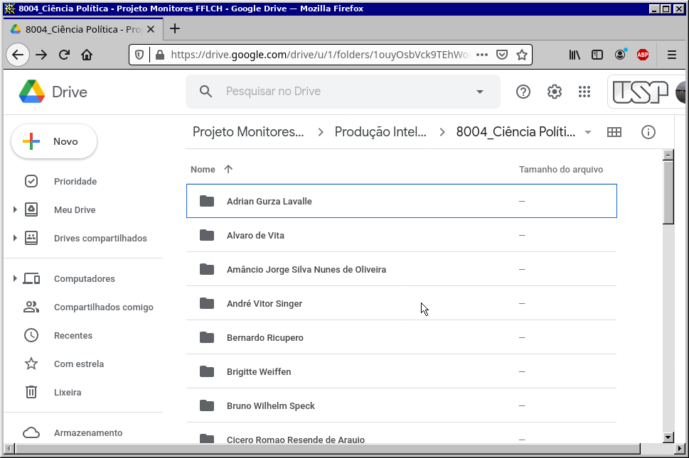
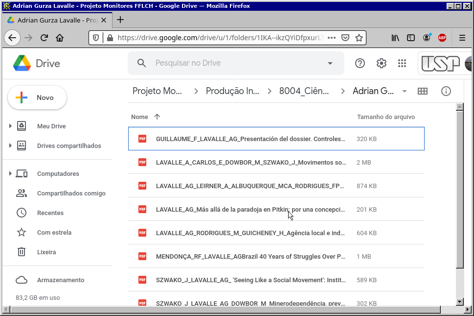

# webscraper-biblioteca

---

Este README está disponível em [English](README.en.md)  

#### O que é esse projeto?

Esse código surgiu de uma tarefa que eu recebi enquanto monitor da Biblioteca Florestan Fernandes da Faculdade de Filosofia, Letras e Ciências Humanas da USP. O trabalho como um todo, aparentemente, envolve o levantamento de informações e a criação de uma base de dados relativa a produção intelectual dos docentes que lecionam nos diferentes programas de pós-graduação da faculdade.

A ideia era aproveitar a ocasião e aprender um pouco mais sobre automatização de processos e raspagem de dados em python e eu espero apenas que o projeto sirva como um exercício prático envolvendo as bibliotecas *requests* e *BeautifulSoup* bem como os módulos *os* e *re* do Python.

#### Requisitos:

- Anaconda (Python 3.8)

- BeautifulSoup 4.9.3

- python-docx 0.8.10

#### O que ele deveria fazer?

A partir de uma planilha contendo uma lista com todos os programas de pós-graduação oferecidos na faculdade, foi criado um repositório no Google Drive contendo uma pasta pra cada um desses programas. Um programa foi designado a cada monitor e a tarefa consiste em:

- Acessar a lista de docentes do programa no portal de dados da FFLCH:

- Acessar a página de cada docente do programa referido e obter uma lista de artigos publicados:

- Criar um arquivo .txt ou .docx na pasta do programa listando o nome dos professores e os títulos de seus respectivos artigos. Além dos títulos é preciso também listar links para consulta online. Deve-se pesquisar os artigos na web e obter o DOI referente à publicação ou ao menos um link ativo:

- Criar uma pasta para cada docente e, sempre que possível baixar o artigo em PDF, salvá-lo nesta pasta:

- Renomear o arquivo da seguinte maneira: Sobrenome_iniciais do nome_Título do artigo (por exemplo, Marques_ACDR_Matéria profusa apresentação do dossiê O que carrega o sangue).

#### O que ele faz?

Como eu não tenho grandes pretensões com esse projeto (inclusive tenho feito a maior parte do trabalho manualmente), o código todo se encontra em um arquivo .ipynb que eu tenho manipulado através do Jupyter Notebook. Um dia, quem sabe, eu vejo se organizo melhor isso aqui e coloco os códigos em formato apropriado.

Atualmente o código tem três blocos que funcionam em separado. O programa como um todo não faz muita coisa.

O primeiro bloco obtém, por meio da biblioteca *requests*, o código fonte do portal de dados e, por meio da biblioteca *BeautifulSoup*, ele localiza os nomes dos docentes e o link da página que contém os títulos dos artigos produzidos por ele. Para cada docente ele também acessa esse link e obtém os títulos.

O segundo bloco de código contém algumas experimentações com a biblioteca *python-docx* para a criação do arquivo .docx que deverá receber os dados.

O terceiro bloco de código basicamente cria pastas a partir de uma lista de nomes.

#### Problemas:

Existem dois problemas principais que eu tenho tentado resolver pra dar continuidade ao projeto.

**1)** O problema dos títulos: o código tem me retornado uma lista com os títulos, contudo esses títulos vem cheios de sequências de escape, por exemplo:

		["\n                                                \n                        Exploração de redes associativas no ensino do léxico\n                        LINHA D'AGUA,\n                        v. 32,\n                        p. 45 - 61,\n                        2019. ISSN: 01033638.\n                    ",
		'\n                                                \n                        Impropriedades lexicais em textos de estudantes universitários\n                        REVISTA DO GELNE,\n                        v. 20,\n                        p. 72 - 82,\n                        2018. ISSN: 15177874.\n                    ',
		'\n                                                \n                        A PLURIDIMENSIONALIDADE DO LÉXICO EM PRÁTICAS DE ENSINO DE PORTUGUÊS\n                        Entremeios,\n                        v. 15,\n                        p. 13 - 30,\n                        2017. ISSN: 21793514.\n                    '] 

Preciso me livrar delas. Se possível, eu precisaria também retirar tudo o que não faz parte do título do artigo e dar uma formatação mais padronizada (primeira letra maiúscula e o resto minúscula). O resultado ideal seria:

		["Exploração de redes associativas no ensino do léxico\n", "Impropriedades lexicais em textos de estudantes universitários\n", "A pluridimensionalidade do léxico em práticas de ensino de português\n", ] 

Tenho tentado conseguir isso através do módulo *re* que trabalha expressões regulares, mas ainda não obtive sucesso.

**2)** O problema do documento de texto: Nesse código eu criei um laço de repetição que localiza os nomes e pra cada nome ele chama um método que localiza os títulos. Esse método retorna uma lista com a relação de artigos que por sua vez é incorporada na lista de docentes, ou seja, a lista de docentes vai conter uma string com o nome, em seguida uma lista de artigos, depois outro nome e assim por diante. O problema disso é que na hora de gravar os dados em um documento de texto eu preciso acessar as linhas dessas listas de artigos. Eu ainda não parei pra analisar essa situação então ainda não tenho ideias.

Qualquer ideia ou sugestão é mais que bem vinda.

Éde
